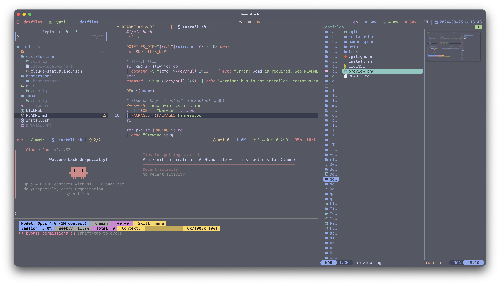

<h1 align="center">dotfiles</h1>

<p align="center">
  <b>tmux</b> + <b>Neovim</b> (LazyVim) + <b>Yazi</b> + <b>Zsh</b> (p10k) + <b>Claude Code</b> statusline + <b>Hammerspoon</b><br>
  managed with <a href="https://www.gnu.org/software/stow/">GNU Stow</a>
</p>

<p align="center">
  
</p>

<p align="center">
  
  
  
  
</p>

---

## What's Included

| Package | Description |
|---------|-------------|
| **tmux** | Catppuccin Frappe theme, Nerd Font icons, OSC52 clipboard (SSH support), TPM plugins, dynamic status-right (conditional online/mem/cpu/battery/IME segments) |
| **nvim** | LazyVim with catppuccin, custom lualine, 27 extras (TS, Python, Ruby, Docker, snacks_image, etc.) |
| **ccstatusline** | Claude Code statusline (powerline theme, usage/token widgets) |
| **zsh** | Powerlevel10k config (catppuccin frappe colors, rainbow style) |
| **yazi** | Catppuccin Frappe theme, flat status bar, 10 plugins (git, full-border, toggle-pane, smart-filter, chmod, jump-to-char, relative-motions, bookmarks, lazygit, compress) |
| **hammerspoon** | Auto-switch IME to ABC on Ctrl+b (macOS, terminal apps only) |

## Quick Start

```bash
git clone git@github.com:songhyun-k/dotfiles.git ~/dotfiles
cd ~/dotfiles
./install.sh
```

### Post-install

| Step | Command |
|------|---------|
| Apply zsh theme | Auto-patched by `install.sh` (`~/.zshrc` managed block). Run `exec zsh` to apply. |
| tmux plugins | Auto-installed by `install.sh` via TPM. Manual: launch tmux, then `prefix + I` |
| tmux-mem-cpu-load | `cd ~/.config/tmux/plugins/tmux-mem-cpu-load && cmake . && make` |
| yazi plugins | Auto-installed by `install.sh` (`ya pkg install`). Manual: `ya pkg install` |
| nvim plugins | Auto-installed on first `nvim` launch |
| Hammerspoon (macOS) | Launch app, grant Accessibility permission |

## Structure

```
dotfiles/
├── zsh/                         # .p10k.zsh (Powerlevel10k config)
├── yazi/.config/yazi/           # yazi theme, init.lua, keybindings, package.toml (plugins are restored via ya pkg install)
├── tmux/.config/tmux/           # tmux.conf, colors, status-right.sh, ime-status
├── nvim/.config/nvim/        # LazyVim config
├── ccstatusline/             # ccstatusline settings + Claude Code merge overlay
├── hammerspoon/.hammerspoon/ # IME auto-switch on Ctrl+b
├── install.sh                # stow + zshrc patch + TPM install + ya pkg install + Claude Code settings merge
└── README.md
```

`install.sh` detects the OS and includes the Hammerspoon package only on macOS. It merges ccstatusline settings into Claude Code's `settings.json` via `jq` (idempotent).

## Dependencies

### Required

| Tool | Purpose | macOS | Linux |
|------|---------|-------|-------|
| git ≥ 2.19 | TPM/lazy.nvim bootstrap | `brew install git` | `apt install git` |
| tmux ≥ 3.2 | Terminal multiplexer (OSC52) | `brew install tmux` | `apt install tmux` |
| Neovim ≥ 0.11.2 | Editor (LazyVim) | `brew install neovim` | official release |
| GNU Stow | Symlink manager | `brew install stow` | `apt install stow` |
| jq | JSON merge in install.sh | `brew install jq` | `apt install jq` |
| Node.js | LSPs, formatters, linters | `brew install node` | `apt install nodejs` |
| Bun | ccstatusline runtime | `brew install oven-sh/bun/bun` | `curl -fsSL https://bun.sh/install \| bash` |
| ripgrep | Search (fzf, snacks_picker) | `brew install ripgrep` | `apt install ripgrep` |
| fd | File finder (fzf, snacks_picker) | `brew install fd` | `apt install fd-find` |
| fzf | Fuzzy finder | `brew install fzf` | `apt install fzf` |
| curl | blink.cmp completions | pre-installed | `apt install curl` |
| cmake | Build tmux-mem-cpu-load | `brew install cmake` | `apt install cmake` |
| ping | tmux-online-status plugin | pre-installed | `apt install iputils-ping` |
| C compiler | Treesitter parsers, tmux-mem-cpu-load | `xcode-select --install` | `apt install build-essential` |
| yazi | File manager | `brew install yazi` | [GitHub releases](https://github.com/sxyazi/yazi/releases) |
| ImageMagick | Neovim image rendering (snacks_image) | `brew install imagemagick` | `apt install imagemagick` |
| [Nerd Font](https://www.nerdfonts.com/) v3+ | Icons (tmux/nvim) | `brew install --cask font-hack-nerd-font` | official release |

### Recommended

| Tool | Purpose | Install |
|------|---------|---------|
| lazygit | Git TUI (`<leader>gg`) | `brew install lazygit` |
| bat | fzf preview highlighting | `brew install bat` |
| yazi-quicklook (macOS) | Quick Look from yazi (`gl`) | custom script in `~/.local/bin/` |

### Language Runtimes

LSPs and linters are auto-installed by Mason. Runtimes must be installed manually.

| Tool | LazyVim Extras | Install |
|------|----------------|---------|
| python3 | lang.python | `brew install python` / `apt install python3` |
| ruby | lang.ruby | `brew install ruby` / `apt install ruby` |
| typescript | lang.typescript, angular, svelte | `npm install -g typescript` |
| prettier | formatting.prettier | `npm install -g prettier` |

### macOS Only

| Tool | Purpose | Install |
|------|---------|---------|
| Hammerspoon | Switch IME to ABC on Ctrl+b | `brew install --cask hammerspoon` |
| im-select | IME indicator in tmux status bar | `brew install im-select` |

## Notes

### First-time Migration

If real config files (not symlinks) already exist, `stow` will conflict. Either delete them first, or use `stow --adopt` to absorb existing files into the package.

### Linux Server terminfo

Remote servers may lack `xterm-ghostty` terminfo. A fallback (`xterm-256color:clipboard`) is included in tmux.conf.

## Acknowledgments

- Neovim config based on [LazyVim starter](https://github.com/LazyVim/starter) (Apache 2.0)
- Color palette: [Catppuccin Frappe](https://github.com/catppuccin/catppuccin) (MIT)

## License

[MIT](LICENSE)
